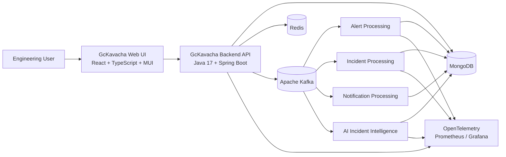
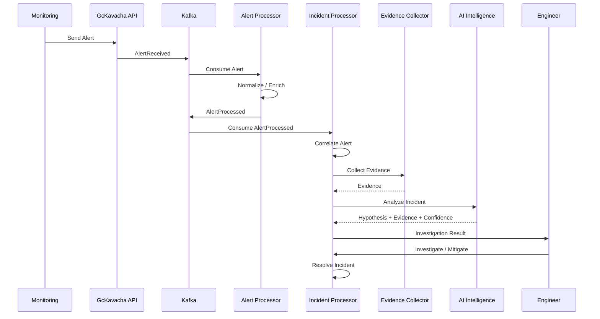
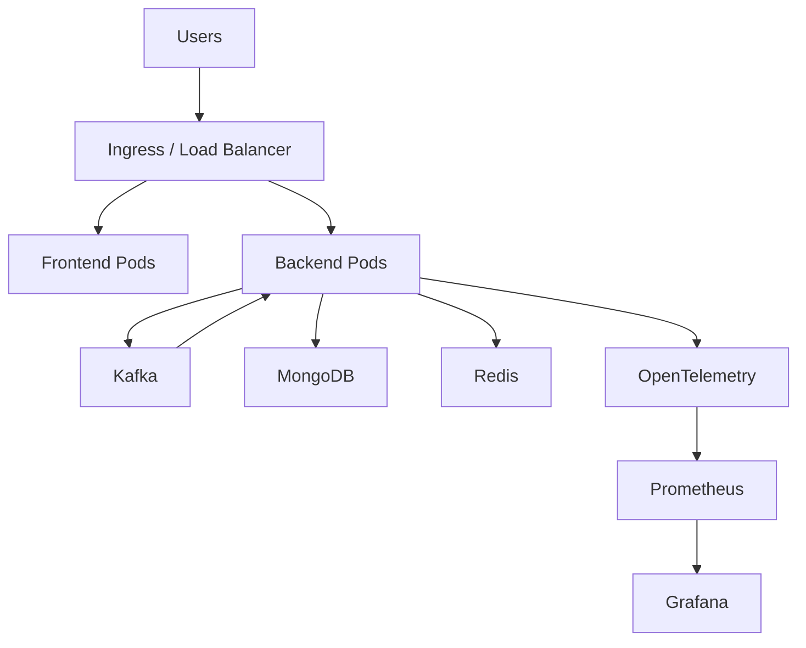

# GcKavacha Architecture

> **GcKavacha — Your shield against production incidents.**

GcKavacha is an **AI-powered distributed incident management and reliability platform** designed to help engineering teams detect, correlate, investigate, and resolve production incidents.

The platform combines **real-time alert processing, event-driven architecture, observability, evidence collection, and AI-assisted incident intelligence** into a unified engineering platform.

---

## 1. Architecture Vision

GcKavacha follows an event-driven architecture where production signals flow through a common incident intelligence pipeline:

```text
Monitoring Signals
       ↓
Alert Ingestion
       ↓
Alert Normalization
       ↓
Alert Correlation
       ↓
Incident Creation / Update
       ↓
Evidence Collection
       ↓
AI Incident Intelligence
       ↓
Investigation
       ↓
Mitigation
       ↓
Resolution
       ↓
Postmortem
```

The architecture is designed to support:

* High-volume alert ingestion
* Distributed event processing
* Incident correlation
* Real-time incident management
* Evidence-driven AI analysis
* Observability
* Horizontal scalability
* Kubernetes deployment
* Multi-service environments
* Future cloud integrations

---

# 2. High-Level Architecture



---

# 3. Architecture Layers

GcKavacha is organized into the following logical layers:

```text
┌─────────────────────────────────────────────┐
│                Presentation                 │
│       React + TypeScript + Material UI      │
├─────────────────────────────────────────────┤
│              Application API               │
│              Spring Boot REST              │
├─────────────────────────────────────────────┤
│               Domain Layer                 │
│   Incident / Alert / Service / Project      │
├─────────────────────────────────────────────┤
│             Event Processing               │
│                  Kafka                     │
├─────────────────────────────────────────────┤
│              Intelligence                  │
│        Spring AI + RAG + LLM               │
├─────────────────────────────────────────────┤
│               Persistence                  │
│          MongoDB + Redis                   │
├─────────────────────────────────────────────┤
│              Observability                 │
│ OpenTelemetry + Prometheus + Grafana       │
└─────────────────────────────────────────────┘
```

---

# 4. Technology Stack

| Layer             | Technology      |
| ----------------- | --------------- |
| Frontend          | React           |
| Frontend Language | TypeScript      |
| UI Framework      | Material UI     |
| Frontend Build    | Webpack         |
| Backend           | Java 17         |
| Backend Framework | Spring Boot 3.x |
| API               | REST            |
| Database          | MongoDB         |
| Cache             | Redis           |
| Messaging         | Apache Kafka    |
| AI Framework      | Spring AI       |
| AI Architecture   | RAG + LLM       |
| Observability     | OpenTelemetry   |
| Metrics           | Prometheus      |
| Dashboards        | Grafana         |
| Containerization  | Docker          |
| Orchestration     | Kubernetes      |
| CI/CD             | GitHub Actions  |

---

# 5. Core Components

## 5.1 Web UI

Technology:

```text
React
TypeScript
Material UI
React Router
Webpack
```

Responsibilities:

* Dashboard
* Projects
* Services
* Environments
* Alerts
* Incidents
* Incident investigation
* Evidence visualization
* AI analysis
* Postmortems

The frontend communicates with the backend through REST APIs.

---

# 6. Backend API

The backend is implemented using:

```text
Java 17
Spring Boot 3.x
Spring Web
Spring Validation
Spring Actuator
Spring AI
```

Responsibilities:

* Authentication
* Authorization
* Project management
* Service management
* Environment management
* Alert management
* Incident management
* Event publishing
* Evidence management
* AI orchestration
* API validation

The backend should remain stateless wherever possible so that multiple instances can run simultaneously.

---

# 7. MongoDB

MongoDB is the primary persistent data store.

Core collections:

```text
users
projects
services
environments
alerts
incidents
incident_events
evidence
root_cause_analyses
postmortems
```

MongoDB stores durable business state.

### Modeling principles

* Major domain entities use separate collections.
* High-volume event data should not be embedded into large parent documents.
* Incident events should remain independently queryable.
* Evidence should remain independently queryable.
* References should normally use entity IDs.
* Large unbounded arrays should be avoided.
* Timestamps should be stored consistently.

---

# 8. Redis

Redis is used for short-lived and high-speed data.

Potential use cases:

```text
Caching
Rate limiting
Distributed locks
Temporary state
Session-related data
Deduplication
Correlation windows
```

Redis should not be treated as the primary source of truth for business data.

MongoDB remains the durable source of truth.

---

# 9. Kafka

Apache Kafka provides the event-driven backbone of GcKavacha.

Kafka is responsible for:

* Alert events
* Incident events
* Notification events
* AI analysis events
* Asynchronous processing
* Decoupling components
* Event distribution

Example event flow:

```text
Monitoring System
       ↓
Alert API
       ↓
Kafka
       ↓
Alert Processor
       ↓
Kafka
       ↓
Incident Processor
       ↓
Kafka
       ↓
AI Incident Intelligence
```

---

# 10. Event-Driven Architecture

The system should avoid putting every operation into a synchronous request chain.

For example:

```text
POST /alerts
      ↓
Validate Alert
      ↓
Persist Alert
      ↓
Publish AlertReceived
      ↓
Return Response
```

The remaining processing can happen asynchronously:

```text
AlertReceived
      ↓
Alert Processor
      ↓
AlertProcessed
      ↓
Incident Processor
      ↓
IncidentCreated / IncidentUpdated
      ↓
Evidence Collection
      ↓
AI Analysis
```

This allows individual components to scale independently.

---

# 11. Alert Processing

The alert processing pipeline is responsible for transforming external monitoring signals into normalized GcKavacha alerts.

```text
External Alert
      ↓
Validation
      ↓
Normalization
      ↓
Deduplication
      ↓
Enrichment
      ↓
Correlation
      ↓
Incident Decision
```

Examples of external alert sources:

```text
Prometheus
Datadog
Cloud Monitoring
Synthetic Monitoring
CI/CD Systems
Custom Applications
```

---

# 12. Incident Management

An incident represents a production problem requiring investigation or action.

The core incident lifecycle is:

```text
OPEN
  ↓
ACKNOWLEDGED
  ↓
INVESTIGATING
  ↓
MITIGATING
  ↓
RESOLVED
  ↓
CLOSED
```

Not every incident must necessarily pass through every state.

The state transitions should be explicitly validated by the backend.

---

# 13. Incident Flow



---

# 14. AI Incident Intelligence

AI is not treated as a simple chatbot.

The AI layer should reason over incident evidence.

Potential evidence sources:

```text
Logs
Metrics
Traces
Alerts
Deployments
Git Changes
Configuration Changes
Historical Incidents
Runbooks
Architecture Information
Test Results
```

The AI workflow is:

```text
Incident
   ↓
Evidence Retrieval
   ↓
Evidence Filtering
   ↓
Context Construction
   ↓
LLM Reasoning
   ↓
Hypotheses
   ↓
Evidence Mapping
   ↓
Confidence
   ↓
Recommended Investigation
```

---

# 15. Evidence-Driven AI

GcKavacha follows an important rule:

> **AI conclusions must be distinguishable from observed evidence.**

The AI should not simply say:

```text
"The database is the root cause."
```

Instead, the result should conceptually contain:

```text
Hypothesis:
Database connection exhaustion may be contributing to the incident.

Evidence:
- Connection pool utilization increased.
- Database response latency increased.
- Error rate increased after deployment X.

Confidence:
87

Recommended Investigation:
Check database connection pool configuration and active connection count.
```

This allows engineers to understand **why** the AI reached a conclusion.

---

# 16. AI Output Model

The conceptual AI response should follow:

```json
{
  "summary": "Potential database connection exhaustion detected.",
  "hypotheses": [
    {
      "description": "Database connection pool exhaustion may be contributing to increased request failures.",
      "confidence": 87,
      "evidence": [
        "Database connection utilization increased.",
        "Request latency increased.",
        "Errors started after deployment."
      ]
    }
  ],
  "recommendations": [
    "Check active database connections.",
    "Review connection pool configuration.",
    "Compare database metrics before and after deployment."
  ]
}
```

AI output should always preserve references to supporting evidence where available.

---

# 17. Observability Architecture

GcKavacha itself must be observable.

The target observability stack is:

```text
Application
    ↓
OpenTelemetry
    ↓
Metrics / Traces / Logs
    ↓
Prometheus
    ↓
Grafana
```

The platform should eventually expose:

* Request latency
* Error rate
* Throughput
* Kafka consumer lag
* Kafka processing latency
* Database latency
* Cache performance
* AI processing latency
* AI failure rate
* Incident processing latency

---

# 18. Deployment Architecture

The target production environment is Kubernetes.



---

# 19. Local Development Architecture

Local development uses Docker Compose.

```text
┌────────────────────────────────────┐
│        Developer Machine           │
│                                    │
│  React UI      Spring Boot API     │
│    :3000            :8080          │
│                     │              │
│          ┌──────────┼─────────┐    │
│          ↓          ↓         ↓    │
│      MongoDB      Redis     Kafka  │
│       :27017      :6379     :9092  │
│                                    │
└────────────────────────────────────┘
```

Docker Compose services:

```text
mongodb
redis
kafka
```

The application itself can initially run directly from the developer machine.

---

# 20. Network Configuration

For local development:

```text
MongoDB
localhost:27017

Redis
localhost:6379

Kafka
localhost:9092

Backend
localhost:8080

Frontend
localhost:3000
```

Inside the Docker network:

```text
MongoDB
mongodb:27017

Redis
redis:6379

Kafka
kafka:29092
```

---

# 21. Scalability Strategy

The architecture should support horizontal scaling.

Example:

```text
                 ┌── Backend Instance 1
Load Balancer ───┼── Backend Instance 2
                 └── Backend Instance 3
                          │
                          ↓
                        Kafka
                     ┌────┴────┐
                     ↓         ↓
              Consumer 1   Consumer 2
```

Kafka consumer groups allow processing workloads to scale independently.

Stateless backend instances allow additional instances to be added without maintaining local application state.

---

# 22. Reliability Principles

GcKavacha should be designed around production reliability principles.

### Idempotency

Processing the same event multiple times should not create duplicate business effects.

### Retry

Transient failures should be retried where appropriate.

### Dead Letter Handling

Messages that cannot be processed should eventually be routed to a dead-letter mechanism.

### Timeout

External dependencies should have explicit timeouts.

### Circuit Breaking

Unhealthy downstream dependencies should not cause cascading failures.

### Backpressure

Consumers should be able to control processing rate when downstream systems are overloaded.

### Observability

Every important asynchronous workflow should be measurable.

---

# 23. Security Principles

Security is a cross-cutting concern.

The platform should eventually support:

```text
Authentication
Authorization
RBAC
JWT
Secure password hashing
Secret management
TLS
Input validation
Audit logging
PII protection
Secure API communication
```

Sensitive information should never be unnecessarily exposed in logs, AI prompts, or API responses.

---

# 24. Domain Model

Core MVP entities:

```text
User
Project
Service
Environment
Alert
Incident
IncidentEvent
```

Supporting entities:

```text
Evidence
RootCauseAnalysis
Postmortem
Team
EscalationPolicy
Notification
Deployment
```

Core relationship:

```text
User
  │
  └── Project
        │
        └── Service
              │
              └── Environment
                    │
                    └── Alert
                           │
                           └── Incident
                                  │
                                  ├── IncidentEvent
                                  ├── Evidence
                                  ├── RootCauseAnalysis
                                  └── Postmortem
```

---

# 25. Architectural Principles

GcKavacha follows these principles:

### 1. API First

Business capabilities should be exposed through well-defined APIs.

### 2. Event Driven

Long-running and asynchronous workflows should use Kafka events.

### 3. Evidence Driven AI

AI conclusions should be grounded in available evidence.

### 4. Stateless Application Layer

Backend instances should remain horizontally scalable.

### 5. Durable Source of Truth

MongoDB stores durable business state.

### 6. Cache Is Not Truth

Redis is used for performance and coordination, not primary business persistence.

### 7. Observable by Default

Important workflows should expose metrics, logs, and traces.

### 8. Secure by Default

Authentication, authorization, validation, and secret management are considered architectural requirements.

### 9. Failure Is Expected

Distributed systems must explicitly handle:

```text
Timeouts
Retries
Duplicates
Partial failures
Unavailable dependencies
Message failures
Network failures
```

### 10. AI Is Assistive

AI recommendations help engineers investigate incidents. AI output should not silently replace human verification.

---

# 26. Architecture Evolution

### Phase 1 — Foundation

```text
Repository
Backend
Frontend
MongoDB
Redis
Kafka
Docker Compose
Architecture Documentation
```

### Phase 2 — Identity

```text
Authentication
JWT
RBAC
User Management
```

### Phase 3 — Service Catalog

```text
Projects
Services
Environments
```

### Phase 4 — Incident Management

```text
Alerts
Incidents
Incident Events
Correlation
```

### Phase 5 — Event-Driven Processing

```text
Kafka
Alert Processing
Incident Processing
Notifications
```

### Phase 6 — AI Incident Intelligence

```text
Evidence
RAG
LLM
Root Cause Analysis
Investigation Recommendations
```

### Phase 7 — Reliability Engineering

```text
SLO
SLA
Error Budgets
Service Dependency Graph
Change Impact
```

### Phase 8 — Production Platform

```text
Kubernetes
CI/CD
OpenTelemetry
Prometheus
Grafana
Security Hardening
Scaling
```

---

# 27. Architecture Decision Records

Major architectural decisions should be documented using ADRs.

Recommended location:

```text
docs/architecture/decisions/
```

Example:

```text
ADR-001-use-mongodb.md
ADR-002-use-kafka.md
ADR-003-use-react-webpack.md
ADR-004-use-spring-ai.md
ADR-005-event-driven-processing.md
```

Each ADR should document:

```text
Context
Decision
Alternatives
Consequences
Trade-offs
```

---

# 28. Repository Architecture

Recommended project structure:

```text
gckavacha/
│
├── backend/
│   ├── src/
│   ├── pom.xml
│   └── README.md
│
├── frontend/
│   └── gckavacha-ui/
│       ├── src/
│       ├── public/
│       ├── package.json
│       └── README.md
│
├── docs/
│   ├── architecture/
│   │   ├── README.md
│   │   ├── high-level-architecture.md
│   │   ├── diagrams/
│   │   └── decisions/
│   │
│   ├── domain/
│   │   └── core-domain-model.md
│   │
│   └── development/
│
├── docker-compose.yml
│
├── .github/
│   └── workflows/
│
└── README.md
```

---

# 29. Architecture Quality Goals

The architecture should progressively demonstrate the following engineering capabilities:

```text
Clean Architecture
Distributed Systems
Event-Driven Architecture
REST API Design
Database Modeling
Caching
Concurrency
Observability
Resilience
Security
AI Engineering
Cloud Native Development
Kubernetes
CI/CD
System Design
```

The objective is not to introduce every technology immediately.

Each capability should be introduced when the product requires it.

---

# 30. Current MVP Architecture

The initial MVP should remain intentionally simple:

```text
React UI
   ↓
Spring Boot API
   ↓
MongoDB

Spring Boot API
   ↓
Redis

Spring Boot API
   ↓
Kafka
   ↓
Async Processing
```

AI and advanced observability will be introduced incrementally.

This keeps the first implementation manageable while preserving the architectural direction required for a production-grade distributed platform.

---

# 31. Definition of Done — Architecture

The architecture foundation is considered complete when:

* [ ] High-level architecture is documented.
* [ ] System context is documented.
* [ ] Container architecture is documented.
* [ ] Incident flow is documented.
* [ ] Deployment architecture is documented.
* [ ] Technology decisions are documented.
* [ ] Core domain model is documented.
* [ ] Major architectural boundaries are clear.
* [ ] Local development architecture is documented.
* [ ] Future evolution path is documented.

---

## GcKavacha

**Your shield against production incidents.**
