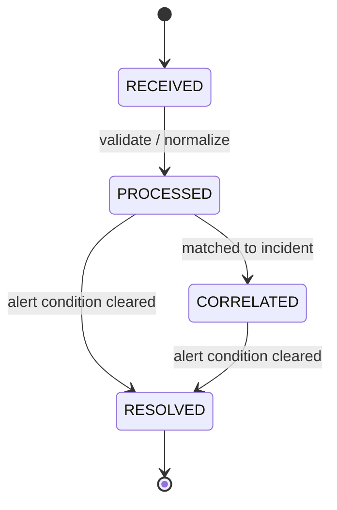
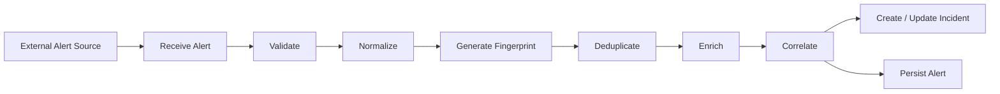
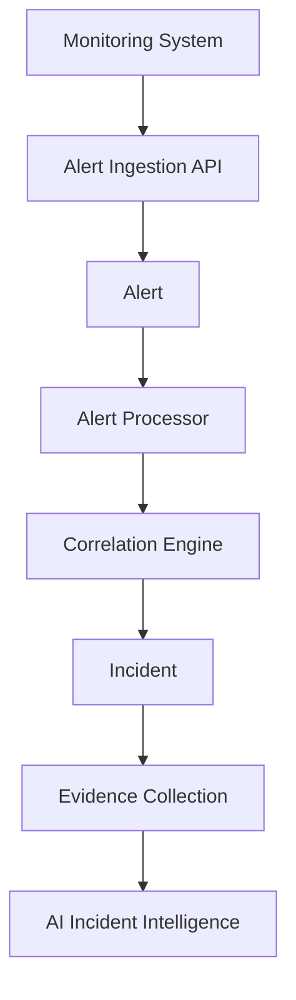

# S12 — GcKavacha Alert Model

## 1. Purpose

This document defines the alert model for GcKavacha.

An **Alert** represents an operational signal received from a monitoring system, application, CI/CD pipeline, synthetic monitor, or another external source.

The alert model defines:

* Alert identity
* Alert source
* Severity
* Lifecycle
* Service and environment association
* Deduplication
* Correlation
* Metadata
* Timestamps
* Relationship between alerts and incidents
* MongoDB persistence strategy

This document defines the domain model only. Implementation of Java entities, repositories, REST APIs, and Kafka consumers is outside the scope of S12.

---

# 2. Alert vs Incident

An alert and an incident are different concepts.

### Alert

An alert represents a **signal** that something may be wrong.

### Incident

An incident represents a **correlated operational problem** that requires investigation or action.

Therefore:

```text
Alert != Incident
```

Multiple alerts can belong to the same incident:

```text
                 ┌── Alert A ──┐
                 │             │
Monitoring ──────┼── Alert B ──┼──► Incident-123
                 │             │
                 └── Alert C ──┘
```

One alert should normally belong to zero or one active incident at a time.

---

# 3. Alert Sources

GcKavacha should support different alert sources.

MVP source types:

```text
PROMETHEUS
APPLICATION
CI_CD
SYNTHETIC
CUSTOM
```

Future sources may include:

```text
DATADOG
CLOUDWATCH
AZURE_MONITOR
GRAFANA
NEW_RELIC
KUBERNETES
```

The source type identifies where the alert originated.

---

# 4. Alert Severity

Alert severity represents the seriousness of the signal.

```text
CRITICAL
HIGH
MEDIUM
LOW
INFO
```

## Severity Definitions

| Severity | Meaning                                                            |
| -------- | ------------------------------------------------------------------ |
| CRITICAL | Immediate or severe production impact is suspected.                |
| HIGH     | Significant service degradation or failure is suspected.           |
| MEDIUM   | Moderate operational problem requiring attention.                  |
| LOW      | Minor problem or warning requiring investigation when appropriate. |
| INFO     | Informational signal without immediate operational impact.         |

Severity is a property of the alert.

It does not automatically determine the final incident severity.

---

# 5. Alert Lifecycle

The MVP alert lifecycle is:

```text
RECEIVED
   ↓
PROCESSED
   ↓
CORRELATED
   ↓
RESOLVED
```

## Lifecycle Diagram



---

# 6. RECEIVED

The `RECEIVED` state means GcKavacha has accepted the alert signal.

At this stage:

```text
External System
      ↓
GcKavacha
      ↓
Alert RECEIVED
```

The alert may not yet have been:

* Normalized
* Deduplicated
* Enriched
* Correlated

---

# 7. PROCESSED

The `PROCESSED` state means the alert has passed the initial processing pipeline.

Processing may include:

```text
Validation
Normalization
Deduplication
Enrichment
Service identification
Environment identification
Severity normalization
Fingerprint generation
```

Example:

```text
External Alert
      ↓
Validation
      ↓
Normalization
      ↓
Fingerprint
      ↓
PROCESSED
```

---

# 8. CORRELATED

The `CORRELATED` state means the alert has been associated with an incident.

Example:

```text
Alert A
Alert B
Alert C
   ↓
Correlation Engine
   ↓
Incident-123
```

The alert should retain the associated incident identifier.

```text
incidentId = Incident-123
```

---

# 9. RESOLVED

The `RESOLVED` state means the alert condition has cleared.

For example:

```text
CPU > 90%
     ↓
Alert created
     ↓
CPU returns to normal
     ↓
Alert resolved
```

Resolving an alert does not necessarily resolve the incident.

Example:

```text
Alert A → RESOLVED

Incident-123 → INVESTIGATING
```

The incident lifecycle must be evaluated independently.

---

# 10. Alert Domain Model

The conceptual Alert model is:

```text
Alert
├── Identity
├── Source
├── Service
├── Environment
├── Severity
├── Lifecycle
├── Fingerprint
├── Correlation
├── Message
├── Metadata
└── Timestamps
```

---

# 11. Alert Fields

Recommended MVP fields:

```text
id
source
externalAlertId
fingerprint
name
title
description
severity
status
serviceId
environmentId
incidentId
labels
metadata
occurredAt
receivedAt
processedAt
resolvedAt
createdAt
updatedAt
```

---

# 12. Field Definitions

## id

Unique GcKavacha identifier.

Example:

```text
66f8b2e7...
```

The identifier should be generated by GcKavacha.

---

## source

Identifies the system that generated the alert.

Example:

```text
PROMETHEUS
APPLICATION
CI_CD
SYNTHETIC
CUSTOM
```

---

## externalAlertId

The identifier supplied by the external alert source.

Example:

```text
prometheus-alert-98231
```

This can help correlate external events with GcKavacha alerts.

---

## fingerprint

A deterministic identifier used for deduplication.

Example:

```text
9c4f7e...
```

The fingerprint should remain stable for logically identical alerts.

---

## name

Machine-readable alert name.

Example:

```text
HighCpuUsage
```

---

## title

Human-readable alert title.

Example:

```text
Payment Service CPU usage is above 90%
```

---

## description

Detailed description of the alert condition.

Example:

```text
CPU utilization for payment-service exceeded
90% for more than 5 minutes.
```

---

## severity

Alert severity.

Allowed values:

```text
CRITICAL
HIGH
MEDIUM
LOW
INFO
```

---

## status

Current alert lifecycle state.

Allowed values:

```text
RECEIVED
PROCESSED
CORRELATED
RESOLVED
```

---

## serviceId

References the affected service.

Example:

```text
serviceId = payment-service-id
```

---

## environmentId

References the affected runtime environment.

Example:

```text
environmentId = production-environment-id
```

---

## incidentId

References the correlated incident.

This field may initially be null.

Example:

```text
incidentId = null
```

After correlation:

```text
incidentId = incident-123
```

---

# 13. Labels

Labels provide structured information useful for filtering and correlation.

Example:

```json
{
  "service": "payment-service",
  "environment": "production",
  "region": "ap-south-1",
  "team": "payments",
  "cluster": "prod-cluster-01"
}
```

Labels should contain relatively small, structured values.

Potential uses:

```text
Filtering
Searching
Deduplication
Correlation
Routing
Aggregation
```

---

# 14. Metadata

Metadata contains additional source-specific information.

Example:

```json
{
  "threshold": "90",
  "duration": "5m",
  "metric": "cpu_usage",
  "region": "ap-south-1"
}
```

Unlike core fields, metadata may vary between alert sources.

The domain model should therefore avoid making every source-specific attribute a first-class field.

---

# 15. Alert Timestamp Model

Important timestamps:

```text
occurredAt
receivedAt
processedAt
resolvedAt
createdAt
updatedAt
```

## occurredAt

When the alert condition occurred according to the source.

## receivedAt

When GcKavacha received the alert.

## processedAt

When GcKavacha completed initial alert processing.

## resolvedAt

When the alert condition was cleared.

## createdAt

When the GcKavacha alert record was created.

## updatedAt

Last modification timestamp.

---

# 16. Alert Processing Flow



---

# 17. Alert Deduplication

External monitoring systems may send the same alert multiple times.

GcKavacha should prevent duplicate alert records when the same logical signal is received repeatedly.

Example:

```text
Monitoring System

Alert 1
Alert 2
Alert 3
Alert 4

All represent:

Payment API error rate > 10%
```

GcKavacha should identify the logical similarity using a fingerprint.

---

# 18. Fingerprint Strategy

A conceptual fingerprint can be generated from stable alert attributes:

```text
fingerprint =
    HASH(
        source
        + service
        + environment
        + alertName
        + relevantLabels
    )
```

Example:

```text
source      = PROMETHEUS
service     = payment-service
environment = production
alertName   = HighErrorRate
region      = ap-south-1
```

Result:

```text
fingerprint = HASH(
    PROMETHEUS
    + payment-service
    + production
    + HighErrorRate
    + ap-south-1
)
```

The exact hashing algorithm will be decided during implementation.

---

# 19. Deduplication Rules

The system should consider:

```text
Same source
+
Same service
+
Same environment
+
Same alert identity
+
Same relevant labels
```

as candidates for the same alert fingerprint.

However, fingerprint design must avoid grouping unrelated events together.

The implementation should therefore define which labels are relevant to identity.

---

# 20. Alert Correlation

Alert correlation determines whether an alert belongs to an existing incident.

Conceptually:

```text
New Alert
    ↓
Find Active Incidents
    ↓
Evaluate Correlation Rules
    ↓
┌───────────────┐
│ Match Found?  │
└───────┬───────┘
        │
   ┌────┴────┐
   │         │
  YES        NO
   │         │
   ↓         ↓
Attach     Create
Alert      Incident
   │         │
   └────┬────┘
        ↓
  Alert Correlated
```

---

# 21. Correlation Signals

Potential correlation attributes include:

```text
Project
Service
Environment
Time Window
Severity
Alert Labels
Error Signature
Deployment
Dependency
Incident Status
```

Example:

```text
payment-service
production
same 5-minute window
database connection errors
```

may indicate that multiple alerts belong to the same incident.

---

# 22. Alert-to-Incident Relationship

The relationship is:

```text
Incident 1 ─── * Alert
```

Conceptually:

```text
Incident-123
    │
    ├── Alert-A
    ├── Alert-B
    └── Alert-C
```

Each alert contains:

```text
incidentId
```

when correlated.

---

# 23. Uncorrelated Alerts

Not every alert should immediately create an incident.

For example:

```text
INFO
LOW
Transient
Known maintenance
Non-actionable
```

may be processed without creating an incident.

Therefore:

```text
Alert
  │
  ├── Correlated → Incident
  │
  └── No Incident
```

The exact incident-creation policy will be defined in the Alert Processing and Incident Processing stories.

---

# 24. Alert Severity vs Incident Severity

These concepts must remain separate.

Example:

```text
Alert A
Severity = HIGH

Alert B
Severity = CRITICAL

Alert C
Severity = MEDIUM
```

After correlation:

```text
Incident-123
Severity = CRITICAL
```

The incident severity may consider:

```text
Alert severity
Customer impact
Service criticality
Number of affected services
Error rate
Business impact
```

The final incident severity model belongs to Incident Management and Reliability Engineering.

---

# 25. Alert Source Normalization

Different systems may represent the same concept differently.

Example:

```text
Prometheus:
severity = critical

Application:
severity = P1

Custom System:
severity = SEV1
```

GcKavacha should normalize these into the common model:

```text
CRITICAL
HIGH
MEDIUM
LOW
INFO
```

The source-specific representation should be preserved in metadata where useful.

---

# 26. Alert Persistence

Recommended MongoDB collection:

```text
alerts
```

Conceptual document:

```json
{
  "_id": "alert-id",
  "source": "PROMETHEUS",
  "externalAlertId": "prometheus-123",
  "fingerprint": "fingerprint-value",
  "name": "HighErrorRate",
  "title": "Payment API error rate is high",
  "description": "Error rate exceeded 10%",
  "severity": "HIGH",
  "status": "CORRELATED",
  "serviceId": "service-id",
  "environmentId": "environment-id",
  "incidentId": "incident-id",
  "labels": {
    "region": "ap-south-1",
    "cluster": "production"
  },
  "metadata": {
    "threshold": "10%",
    "duration": "5m"
  },
  "occurredAt": "timestamp",
  "receivedAt": "timestamp",
  "processedAt": "timestamp",
  "resolvedAt": null,
  "createdAt": "timestamp",
  "updatedAt": "timestamp"
}
```

---

# 27. MongoDB Index Strategy

Indexes will be implemented later, but the domain model should anticipate likely query patterns.

Potential indexes:

```text
fingerprint
incidentId
serviceId
environmentId
status
severity
occurredAt
receivedAt
```

Potential compound indexes may eventually include:

```text
serviceId + environmentId + occurredAt
```

and:

```text
fingerprint + status
```

Actual indexes should be introduced based on measured query patterns.

---

# 28. Alert Search Requirements

The model should eventually support queries such as:

```text
Find all alerts for a service
Find alerts for an environment
Find active alerts
Find alerts by severity
Find alerts for an incident
Find alerts received during a time range
Find alerts by fingerprint
Find alerts from a source
```

---

# 29. Alert and Kafka

Alert processing will eventually use Kafka.

Conceptual flow:

```text
External Source
      ↓
Alert API
      ↓
Persist Alert
      ↓
Publish AlertReceived
      ↓
Kafka
      ↓
Alert Processor
      ↓
Publish AlertProcessed
      ↓
Kafka
      ↓
Incident Processor
```

Potential event names:

```text
alert.received
alert.processed
alert.correlated
alert.resolved
```

Event contracts will be defined separately in S13 — Event Model.

---

# 30. Alert and Notifications

Alerts may eventually trigger notifications based on:

```text
Severity
Service
Environment
Incident correlation
Escalation policy
```

Example:

```text
CRITICAL Alert
      ↓
Incident Created
      ↓
Escalation Policy
      ↓
Notification
```

Notification behavior is outside the scope of S12.

---

# 31. Alert Security Considerations

Alert payloads may contain sensitive information.

Potential sensitive data:

```text
User information
Request data
Customer identifiers
IP addresses
Tokens
Internal URLs
Stack traces
Database information
```

Therefore:

* Do not log complete external payloads by default.
* Sensitive metadata should be filtered.
* PII should be protected.
* AI prompts must not blindly include raw alert payloads.
* Access to alerts should follow project/service authorization.

Security implementation belongs to the Security epic.

---

# 32. Alert State vs Incident State

Alert and incident states are intentionally independent.

Example:

```text
Alert:
RESOLVED

Incident:
INVESTIGATING
```

This is valid.

Another example:

```text
Alert:
CORRELATED

Incident:
MITIGATING
```

This is also valid.

The incident represents the broader operational problem.

The alert represents an individual signal.

---

# 33. Example End-to-End Scenario

A production payment service starts returning errors.

### Step 1 — Monitoring

```text
Payment API error rate > 10%
```

### Step 2 — Alert Received

```text
Alert status = RECEIVED
```

### Step 3 — Normalize

```text
Source = PROMETHEUS
Severity = HIGH
Service = payment-service
Environment = production
```

### Step 4 — Fingerprint

```text
Fingerprint generated
```

### Step 5 — Process

```text
Alert status = PROCESSED
```

### Step 6 — Correlation

Existing incident found:

```text
Incident-123
```

### Step 7 — Associate

```text
Alert.incidentId = Incident-123
```

### Step 8 — Update Alert

```text
Alert status = CORRELATED
```

### Step 9 — Incident Processing

Incident may now collect:

```text
Logs
Metrics
Traces
Deployments
Git changes
Other alerts
```

### Step 10 — Resolution

When the alert condition clears:

```text
Alert status = RESOLVED
```

The incident may still remain active until the broader production problem is confirmed as resolved.

---

# 34. Architecture Diagram



---

# 35. MVP Alert Model

The MVP should keep the model focused.

### Required

```text
id
source
externalAlertId
fingerprint
name
title
description
severity
status
serviceId
environmentId
incidentId
labels
metadata
occurredAt
receivedAt
processedAt
resolvedAt
createdAt
updatedAt
```

### Future

```text
deduplicationCount
lastSeenAt
suppressionRuleId
maintenanceWindowId
alertGroupId
parentAlertId
routingKey
escalationPolicyId
```

Future fields should not be added until there is a concrete requirement.

---

# 36. Design Principles

### Principle 1 — Alert Is a Signal

An alert represents evidence that something may be wrong.

### Principle 2 — Alert Is Not an Incident

An incident represents a broader operational problem.

### Principle 3 — Deduplicate Early

Duplicate external signals should not unnecessarily create duplicate domain records.

### Principle 4 — Preserve Source Information

External identifiers and source-specific metadata should be retained.

### Principle 5 — Normalize Core Fields

Different external systems should map into a common GcKavacha model.

### Principle 6 — Correlation Is Separate

Alert ingestion and incident correlation should remain separate responsibilities.

### Principle 7 — Alert Resolution Does Not Automatically Resolve an Incident

An incident may contain multiple alerts and other evidence.

### Principle 8 — Security by Default

Alert payloads may contain sensitive operational information.

---

# 37. S12 Scope

## In Scope

* Alert entity
* Alert fields
* Alert source model
* Severity model
* Alert lifecycle
* Alert deduplication
* Alert fingerprint
* Alert correlation
* Alert-to-incident relationship
* Metadata
* MongoDB persistence model
* Architecture diagrams

## Out of Scope

* Java entity implementation
* MongoDB repository implementation
* Alert REST API
* Kafka implementation
* Correlation algorithm implementation
* Notification implementation
* Escalation policies
* AI implementation
* Authentication implementation

---

# 38. Acceptance Criteria

* [ ] Alert entity is documented.
* [ ] Alert fields are defined.
* [ ] Alert source types are defined.
* [ ] Severity levels are defined.
* [ ] Alert lifecycle is defined.
* [ ] Alert state diagram exists.
* [ ] Alert-to-incident relationship is documented.
* [ ] Deduplication strategy is documented.
* [ ] Fingerprint strategy is documented.
* [ ] Correlation concept is documented.
* [ ] MongoDB document structure is documented.
* [ ] Security considerations are documented.
* [ ] MVP and future fields are separated.
* [ ] No implementation code is introduced.

---

# 39. Final Alert Model

The resulting conceptual model is:

```text
                         ┌──────────────────┐
                         │ Monitoring Source│
                         └────────┬─────────┘
                                  │
                                  ▼
                         ┌──────────────────┐
                         │      ALERT       │
                         ├──────────────────┤
                         │ id               │
                         │ source           │
                         │ externalAlertId  │
                         │ fingerprint      │
                         │ severity         │
                         │ status           │
                         │ serviceId        │
                         │ environmentId    │
                         │ incidentId       │
                         │ labels           │
                         │ metadata         │
                         │ timestamps       │
                         └────────┬─────────┘
                                  │
                         Correlation
```
