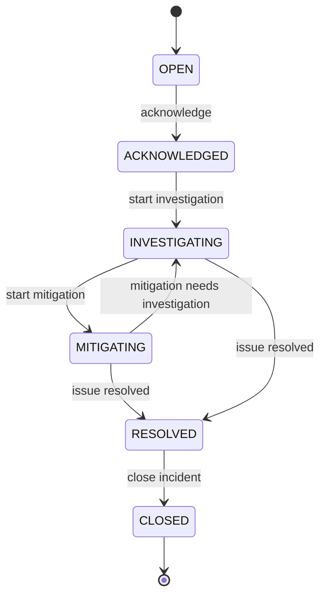

# S11 — GcKavacha Incident Lifecycle

## 1. Purpose

This document defines the lifecycle of an incident in GcKavacha.

The lifecycle establishes:

* Incident states
* Valid state transitions
* Transition rules
* Terminal states
* Actor responsibilities
* Lifecycle events
* Backend validation requirements

The lifecycle will be used by:

* Incident APIs
* Incident processing
* Kafka events
* Notification processing
* UI workflows
* Audit history
* AI incident intelligence

---

# 2. Incident States

GcKavacha MVP uses the following incident states:

```text
OPEN
ACKNOWLEDGED
INVESTIGATING
MITIGATING
RESOLVED
CLOSED
```

## State Definitions

| State         | Description                                                        |
| ------------- | ------------------------------------------------------------------ |
| OPEN          | Incident has been created but nobody has acknowledged it yet.      |
| ACKNOWLEDGED  | An engineer/team has acknowledged ownership of the incident.       |
| INVESTIGATING | The incident is actively being investigated.                       |
| MITIGATING    | Engineers are actively applying mitigation actions.                |
| RESOLVED      | The immediate production problem has been resolved.                |
| CLOSED        | Incident lifecycle and required follow-up activities are complete. |

---

# 3. Lifecycle Diagram



---

# 4. Valid State Transitions

The following transitions are valid in the MVP.

| Current State | Action                 | Next State    |
| ------------- | ---------------------- | ------------- |
| OPEN          | Acknowledge            | ACKNOWLEDGED  |
| ACKNOWLEDGED  | Start Investigation    | INVESTIGATING |
| INVESTIGATING | Start Mitigation       | MITIGATING    |
| MITIGATING    | Continue Investigation | INVESTIGATING |
| INVESTIGATING | Resolve                | RESOLVED      |
| MITIGATING    | Resolve                | RESOLVED      |
| RESOLVED      | Close                  | CLOSED        |

---

# 5. OPEN

## Meaning

The incident has been created and requires attention.

Typical creation sources:

```text
Alert correlation
Manual incident creation
External monitoring integration
Synthetic monitoring
Future anomaly detection
```

Example:

```text
Alert:
Payment API error rate > 10%

        ↓

Incident created

        ↓

Status = OPEN
```

## Allowed Transition

```text
OPEN
  ↓
ACKNOWLEDGED
```

An incident should not normally move directly from `OPEN` to `RESOLVED` in the MVP because acknowledgement and investigation provide an operational audit trail.

---

# 6. ACKNOWLEDGED

## Meaning

An engineer or team has acknowledged the incident and taken responsibility for handling it.

Typical actions:

```text
Assign engineer
Assign team
Acknowledge incident
Add initial investigation note
```

## Allowed Transition

```text
ACKNOWLEDGED
       ↓
INVESTIGATING
```

---

# 7. INVESTIGATING

## Meaning

The incident is actively being analyzed.

Typical activities:

```text
Review alerts
Inspect logs
Inspect metrics
Inspect traces
Review recent deployments
Review Git changes
Review historical incidents
Collect evidence
Run diagnostic commands
Use AI incident analysis
```

The incident may remain in this state while engineers gather sufficient evidence.

## Allowed Transitions

```text
INVESTIGATING
      ├──→ MITIGATING
      │
      └──→ RESOLVED
```

---

# 8. MITIGATING

## Meaning

Engineers are actively applying a mitigation to reduce or remove the production impact.

Examples:

```text
Rollback deployment
Scale service
Disable feature
Change configuration
Fail over
Restart unhealthy component
Apply temporary workaround
```

## Allowed Transitions

```text
MITIGATING
      ├──→ INVESTIGATING
      │
      └──→ RESOLVED
```

### Return to Investigation

If mitigation does not resolve the issue:

```text
MITIGATING
    ↓
Mitigation unsuccessful
    ↓
INVESTIGATING
```

This allows the team to continue gathering evidence and evaluating additional hypotheses.

---

# 9. RESOLVED

## Meaning

The immediate production impact has been resolved.

Resolution should be based on observable evidence where possible.

Examples:

```text
Error rate returned to normal
Latency returned to normal
Service recovered
Customer impact ended
Failed requests returned to baseline
```

The system should record:

```text
resolvedAt
resolvedBy
resolutionSummary
```

## Allowed Transition

```text
RESOLVED
    ↓
CLOSED
```

---

# 10. CLOSED

## Meaning

The incident lifecycle is complete.

Closing an incident indicates that required operational follow-up has been completed.

Potential requirements:

```text
Resolution documented
Timeline captured
Root cause recorded
Follow-up actions created
Postmortem completed when required
```

`CLOSED` is a terminal state in the MVP.

```text
CLOSED
   ↓
 [END]
```

---

# 11. Invalid Transitions

The backend must reject invalid state transitions.

Examples:

```text
OPEN → RESOLVED
OPEN → CLOSED

ACKNOWLEDGED → CLOSED
ACKNOWLEDGED → RESOLVED

RESOLVED → INVESTIGATING
RESOLVED → MITIGATING

CLOSED → OPEN
CLOSED → INVESTIGATING
CLOSED → RESOLVED
```

These transitions should not be performed through normal incident APIs.

---

# 12. Transition Validation

The backend should validate every requested transition.

Conceptually:

```text
Current State
      +
Requested Action
      ↓
Transition Validator
      ↓
Valid?
  ┌───┴───┐
 YES     NO
  ↓       ↓
Update   Reject
State    Request
```

Example:

```text
Current:
INVESTIGATING

Requested:
START_MITIGATION

Result:
Valid

New State:
MITIGATING
```

Invalid example:

```text
Current:
OPEN

Requested:
CLOSE

Result:
Invalid transition
```

---

# 13. Transition Events

Every successful lifecycle transition should generate an incident event.

Example:

```text
OPEN
 ↓
ACKNOWLEDGED
```

Event:

```json
{
  "eventType": "INCIDENT_ACKNOWLEDGED",
  "previousState": "OPEN",
  "newState": "ACKNOWLEDGED",
  "actorId": "user-id",
  "occurredAt": "timestamp"
}
```

Recommended lifecycle events:

```text
INCIDENT_CREATED
INCIDENT_ACKNOWLEDGED
INVESTIGATION_STARTED
MITIGATION_STARTED
INVESTIGATION_RESUMED
INCIDENT_RESOLVED
INCIDENT_CLOSED
```

---

# 14. Incident Lifecycle Timeline

An incident should maintain an auditable timeline.

Example:

```text
10:01:15  INCIDENT_CREATED
          Status: OPEN

10:03:20  INCIDENT_ACKNOWLEDGED
          Status: ACKNOWLEDGED
          Actor: engineer-123

10:05:10  INVESTIGATION_STARTED
          Status: INVESTIGATING

10:12:45  MITIGATION_STARTED
          Status: MITIGATING

10:18:30  INCIDENT_RESOLVED
          Status: RESOLVED

10:35:00  INCIDENT_CLOSED
          Status: CLOSED
```

This timeline will later support:

* Incident dashboards
* Audit history
* Postmortems
* MTTA calculation
* MTTR calculation
* AI analysis
* Reliability analytics

---

# 15. Lifecycle Timestamps

The Incident entity should support timestamps corresponding to important lifecycle milestones.

```text
createdAt
acknowledgedAt
investigationStartedAt
mitigationStartedAt
resolvedAt
closedAt
updatedAt
```

These timestamps should be set by the backend rather than trusted from the frontend.

---

# 16. Actor Information

Lifecycle changes should record who performed the action when applicable.

Example:

```text
createdBy
acknowledgedBy
investigatedBy
mitigatedBy
resolvedBy
closedBy
```

For the MVP, the complete actor model can be simplified where necessary, while `IncidentEvent.actorId` provides the audit trail.

---

# 17. Human and System Actions

Not every lifecycle transition must originate from a human.

Possible actors:

```text
USER
SYSTEM
AUTOMATION
AI_ASSISTED
INTEGRATION
```

Examples:

```text
Monitoring integration
    ↓
System creates incident

Engineer
    ↓
Acknowledges incident

Automation
    ↓
Triggers mitigation

Engineer
    ↓
Confirms resolution
```

AI may recommend an action, but the MVP should keep the actual lifecycle transition under an authorized system or human action.

---

# 18. Incident Lifecycle and Kafka

Lifecycle changes will eventually produce Kafka events.

Example:

```text
Incident State Change
        ↓
Incident Service
        ↓
Kafka
        ↓
┌───────────────┬────────────────┬────────────────┐
↓               ↓                ↓
Notification    Audit            AI Processing
Processor       Processing       / Analytics
```

Example Kafka event:

```text
incident.lifecycle.changed
```

Payload concept:

```json
{
  "eventId": "event-id",
  "incidentId": "incident-id",
  "previousState": "INVESTIGATING",
  "newState": "MITIGATING",
  "actorId": "user-id",
  "occurredAt": "timestamp"
}
```

Kafka event schemas will be formally defined in a later story.

---

# 19. Lifecycle and Notifications

Certain state changes may trigger notifications.

Examples:

```text
INCIDENT_CREATED
        ↓
Notify on-call team

INCIDENT_ACKNOWLEDGED
        ↓
Update notification state

INCIDENT_MITIGATING
        ↓
Notify interested stakeholders

INCIDENT_RESOLVED
        ↓
Send resolution notification

INCIDENT_CLOSED
        ↓
Complete incident communication
```

Notification behavior belongs to the Notification & Escalation epic and is not implemented in S11.

---

# 20. Lifecycle and AI

AI Incident Intelligence can assist engineers during:

```text
INVESTIGATING
MITIGATING
```

Example:

```text
INVESTIGATING
      ↓
Collect Evidence
      ↓
AI Analysis
      ↓
Hypothesis
      ↓
Recommended Investigation
      ↓
Engineer Decision
```

AI should not silently change the incident lifecycle.

The AI may recommend:

```text
"Consider rolling back deployment X."
```

The engineer or authorized automation must explicitly execute the mitigation.

---

# 21. State Machine Rules

The MVP state machine follows these rules:

### Rule 1

Every incident must have exactly one current lifecycle state.

### Rule 2

Every lifecycle transition must be validated.

### Rule 3

Invalid transitions must be rejected.

### Rule 4

Successful transitions must generate an audit event.

### Rule 5

Transition timestamps are generated by the backend.

### Rule 6

Terminal `CLOSED` incidents cannot normally transition back to an active state.

### Rule 7

AI recommendations do not automatically change lifecycle state.

### Rule 8

Lifecycle history must be preserved.

---

# 22. State Transition Matrix

| From / To     | OPEN | ACK | INVESTIGATING | MITIGATING | RESOLVED | CLOSED |
| ------------- | ---: | --: | ------------: | ---------: | -------: | -----: |
| OPEN          |    — |   ✅ |             ❌ |          ❌ |        ❌ |      ❌ |
| ACKNOWLEDGED  |    ❌ |   — |             ✅ |          ❌ |        ❌ |      ❌ |
| INVESTIGATING |    ❌ |   ❌ |             — |          ✅ |        ✅ |      ❌ |
| MITIGATING    |    ❌ |   ❌ |             ✅ |          — |        ✅ |      ❌ |
| RESOLVED      |    ❌ |   ❌ |             ❌ |          ❌ |        — |      ✅ |
| CLOSED        |    ❌ |   ❌ |             ❌ |          ❌ |        ❌ |      — |

---

# 23. Metrics Enabled by the Lifecycle

The lifecycle allows GcKavacha to calculate operational metrics.

### MTTA

Mean Time To Acknowledge:

```text
acknowledgedAt - createdAt
```

### Investigation Start Time

```text
investigationStartedAt - acknowledgedAt
```

### MTTR

Mean Time To Resolve:

```text
resolvedAt - createdAt
```

### Time To Close

```text
closedAt - resolvedAt
```

These metrics will later support the Reliability Engineering epic.

---

# 24. Future Lifecycle Extensions

The MVP lifecycle intentionally remains small.

Future states may include:

```text
PENDING
ESCALATED
MONITORING
REOPENED
CANCELLED
```

These should not be introduced until a concrete product requirement exists.

---

# 25. S11 Scope

## In Scope

* Incident states
* State definitions
* Valid transitions
* Invalid transitions
* State machine
* Lifecycle events
* Transition validation rules
* Lifecycle timestamps
* Audit requirements
* AI interaction rules

## Out of Scope

* Java implementation
* MongoDB repository implementation
* REST endpoints
* Kafka implementation
* Notification implementation
* Escalation policies
* AI implementation
* UI implementation

---

# 26. Acceptance Criteria

* [ ] Incident states are documented.
* [ ] State meanings are documented.
* [ ] Valid transitions are defined.
* [ ] Invalid transitions are defined.
* [ ] Mermaid state diagram exists.
* [ ] Transition matrix exists.
* [ ] Lifecycle events are defined.
* [ ] Lifecycle timestamps are defined.
* [ ] Backend validation requirements are documented.
* [ ] AI interaction with lifecycle is documented.
* [ ] Future states are separated from MVP.
* [ ] No implementation code is introduced.

---

## Result

After completing S11, the GcKavacha incident lifecycle is formally defined as:

```text
OPEN
  ↓
ACKNOWLEDGED
  ↓
INVESTIGATING
  ↓
MITIGATING
  ↓
RESOLVED
  ↓
CLOSED
```

with controlled transitions, audit events, timestamps, and clear boundaries between human/system actions and AI recommendations.
