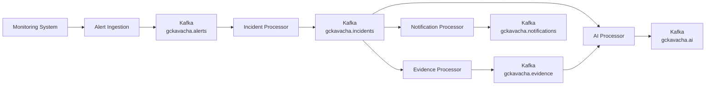
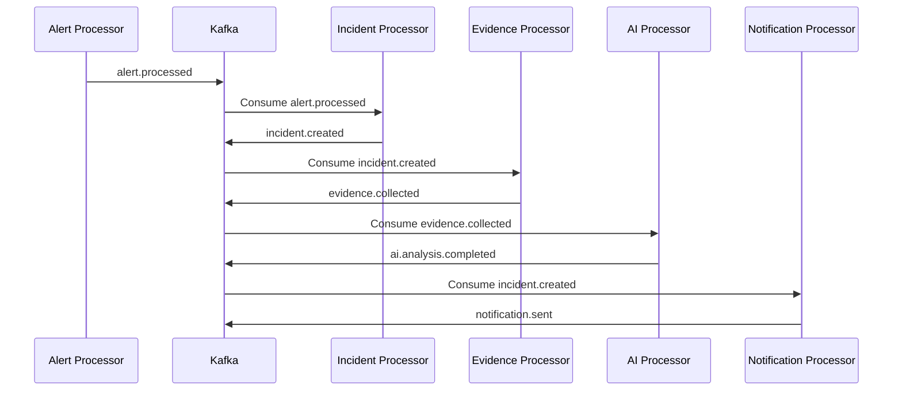

# S13 — GcKavacha Event Model

## 1. Purpose

This document defines the event model for GcKavacha.

GcKavacha uses an event-driven architecture to decouple alert processing, incident management, notification processing, evidence collection, and AI incident intelligence.

The event model defines:

* Common event envelope
* Event identity
* Event types
* Aggregate information
* Event producers
* Event consumers
* Correlation ID
* Causation ID
* Actor information
* Event versioning
* Kafka topic strategy
* Consumer groups
* Idempotency
* Retry behavior
* Dead-letter handling
* Event ordering
* Event evolution

This document defines the architecture and contracts. Kafka producers, consumers, schemas, and Java implementations are outside the scope of S13.

---

# 2. Event-Driven Architecture

GcKavacha uses Kafka as the asynchronous communication backbone.

The high-level flow is:

```text
Alert
  ↓
Alert Received
  ↓
Alert Processed
  ↓
Alert Correlated
  ↓
Incident Created / Updated
  ↓
Incident Lifecycle Changed
  ↓
Evidence Collected
  ↓
AI Analysis
  ↓
Incident Resolved
  ↓
Incident Closed
```

The event-driven approach allows individual processing components to evolve and scale independently.

---

# 3. Why Events?

A synchronous architecture could look like:

```text
HTTP Request
    ↓
Alert Service
    ↓
Incident Service
    ↓
Evidence Service
    ↓
AI Service
    ↓
Notification Service
    ↓
HTTP Response
```

This creates tight coupling and increases the impact of downstream failures.

GcKavacha instead uses:

```text
HTTP Request
    ↓
Alert Service
    ↓
Kafka
    ↓
Independent Consumers
```

Example:

```text
                    ┌── Alert Processor
                    │
Alert API → Kafka ──┼── Incident Processor
                    │
                    ├── Notification Processor
                    │
                    └── AI Processor
```

Benefits:

* Loose coupling
* Asynchronous processing
* Independent scaling
* Failure isolation
* Better resilience
* Event history
* Easier integration
* Future extensibility

---

# 4. Event vs Command

GcKavacha must distinguish between commands and events.

## Command

A command asks a component to perform an action.

Example:

```text
CreateIncident
StartInvestigation
StartMitigation
ResolveIncident
```

A command represents an intention.

```text
"Do something."
```

## Event

An event states that something has already happened.

Example:

```text
IncidentCreated
InvestigationStarted
MitigationStarted
IncidentResolved
```

An event represents a fact.

```text
"Something happened."
```

### Principle

```text
Command → Request for action

Event → Fact that an action occurred
```

---

# 5. Domain Events

A domain event represents an important business event inside GcKavacha.

Examples:

```text
incident.created
incident.lifecycle.changed
incident.severity.changed
incident.assignee.changed
```

Domain events represent changes to the business domain.

---

# 6. Integration Events

Integration events are events intended to communicate between independently deployable components or external systems.

Examples:

```text
alert.received
notification.requested
ai.analysis.requested
```

The initial implementation may use the same Kafka infrastructure for both domain and integration events.

The distinction should remain clear at the conceptual level.

---

# 7. Common Event Envelope

All GcKavacha events should use a common envelope.

Conceptually:

```json
{
  "eventId": "uuid",
  "eventType": "incident.lifecycle.changed",
  "eventVersion": 1,
  "aggregateType": "INCIDENT",
  "aggregateId": "incident-123",
  "source": "incident-service",
  "correlationId": "correlation-123",
  "causationId": "event-456",
  "actor": {
    "type": "USER",
    "id": "user-123"
  },
  "occurredAt": "2026-09-30T15:30:00Z",
  "payload": {},
  "metadata": {}
}
```

---

# 8. Event Identity

## eventId

A globally unique identifier for the event.

Example:

```text
550e8400-e29b-41d4-a716-446655440000
```

Requirements:

* Globally unique
* Immutable
* Generated by the event producer
* Used for idempotency

---

# 9. Event Type

`eventType` identifies what happened.

Examples:

```text
alert.received
alert.processed
alert.correlated
alert.resolved

incident.created
incident.lifecycle.changed
incident.severity.changed
incident.assignee.changed

evidence.collected

ai.analysis.requested
ai.analysis.completed

notification.requested
notification.sent
```

Event types should use lowercase dot-separated names.

---

# 10. Event Version

`eventVersion` identifies the version of the event contract.

Example:

```json
{
  "eventType": "incident.created",
  "eventVersion": 1
}
```

When the event contract changes in a backward-incompatible way, the version must change.

Example:

```text
incident.created v1
incident.created v2
```

The exact compatibility strategy will be implemented during Kafka integration.

---

# 11. Aggregate Type

`aggregateType` identifies the domain object associated with the event.

Examples:

```text
USER
PROJECT
SERVICE
ENVIRONMENT
ALERT
INCIDENT
EVIDENCE
ROOT_CAUSE_ANALYSIS
POSTMORTEM
NOTIFICATION
```

Example:

```json
{
  "aggregateType": "INCIDENT",
  "aggregateId": "incident-123"
}
```

---

# 12. Aggregate ID

`aggregateId` identifies the specific domain object affected by the event.

Example:

```text
aggregateType = INCIDENT
aggregateId   = incident-123
```

This allows consumers to understand which business object the event belongs to.

---

# 13. Source

`source` identifies the component that produced the event.

Examples:

```text
alert-service
incident-service
notification-service
ai-service
evidence-service
```

Example:

```json
{
  "source": "incident-service"
}
```

The source should identify the logical producer rather than a specific container or machine.

---

# 14. Correlation ID

The `correlationId` connects events belonging to the same business workflow.

Example:

```text
Alert Received
      │
      ├── correlationId = CORR-123
      ↓
Alert Processed
      │
      ├── correlationId = CORR-123
      ↓
Incident Created
      │
      ├── correlationId = CORR-123
      ↓
AI Analysis Requested
      │
      └── correlationId = CORR-123
```

This allows engineers to trace an entire workflow across services.

---

# 15. Causation ID

The `causationId` identifies the event that directly caused the current event.

Example:

```text
Event A
  ↓
Event B
  ↓
Event C
```

Event B:

```text
causationId = Event A.eventId
```

Event C:

```text
causationId = Event B.eventId
```

This creates an event causality chain.

---

# 16. Correlation vs Causation

These fields have different purposes.

### Correlation

Answers:

> Which workflow does this event belong to?

### Causation

Answers:

> Which previous event directly caused this event?

Example:

```text
AlertReceived
    │
    ├── correlationId = CORR-100
    │
    └── eventId = EVT-001

AlertProcessed
    │
    ├── correlationId = CORR-100
    ├── causationId = EVT-001
    └── eventId = EVT-002

IncidentCreated
    │
    ├── correlationId = CORR-100
    ├── causationId = EVT-002
    └── eventId = EVT-003
```

---

# 17. Actor

Events may be generated by different actors.

Supported actor types:

```text
USER
SYSTEM
AUTOMATION
INTEGRATION
AI_ASSISTED
```

Example:

```json
{
  "actor": {
    "type": "USER",
    "id": "user-123"
  }
}
```

For system-generated events:

```json
{
  "actor": {
    "type": "SYSTEM",
    "id": "alert-processor"
  }
}
```

---

# 18. occurredAt

`occurredAt` represents when the event actually occurred.

Example:

```text
2026-09-30T15:30:00Z
```

The timestamp should be generated by the event producer.

Events should use UTC timestamps.

---

# 19. Payload

`payload` contains event-specific business information.

Example:

```json
{
  "payload": {
    "previousState": "INVESTIGATING",
    "newState": "MITIGATING",
    "reason": "Rollback initiated"
  }
}
```

The common envelope remains stable while the payload changes according to the event type.

---

# 20. Metadata

`metadata` contains technical or contextual information.

Example:

```json
{
  "metadata": {
    "environment": "production",
    "region": "ap-south-1",
    "traceId": "trace-123"
  }
}
```

Metadata should not contain large unbounded objects.

---

# 21. Complete Event Example

```json
{
  "eventId": "evt-001",
  "eventType": "incident.lifecycle.changed",
  "eventVersion": 1,
  "aggregateType": "INCIDENT",
  "aggregateId": "incident-123",
  "source": "incident-service",
  "correlationId": "corr-100",
  "causationId": "evt-000",
  "actor": {
    "type": "USER",
    "id": "user-123"
  },
  "occurredAt": "2026-09-30T15:30:00Z",
  "payload": {
    "previousState": "INVESTIGATING",
    "newState": "MITIGATING",
    "reason": "Rollback initiated"
  },
  "metadata": {
    "environment": "production",
    "traceId": "trace-123"
  }
}
```

---

# 22. Event Taxonomy

Initial GcKavacha event taxonomy:

```text
Alert Events
├── alert.received
├── alert.processed
├── alert.correlated
└── alert.resolved

Incident Events
├── incident.created
├── incident.lifecycle.changed
├── incident.severity.changed
└── incident.assignee.changed

Evidence Events
└── evidence.collected

AI Events
├── ai.analysis.requested
└── ai.analysis.completed

Notification Events
├── notification.requested
└── notification.sent
```

---

# 23. Alert Events

## alert.received

Published when GcKavacha receives a new alert.

```text
Producer:
Alert Ingestion

Consumers:
Alert Processor
Audit
Observability
```

---

## alert.processed

Published after alert validation and normalization.

```text
Producer:
Alert Processor

Consumers:
Incident Processor
Analytics
```

---

## alert.correlated

Published when an alert is associated with an incident.

```text
Producer:
Incident Processor

Consumers:
Notification
Analytics
AI Processing
```

---

## alert.resolved

Published when the source alert condition clears.

```text
Producer:
Alert Processor

Consumers:
Incident Processor
Analytics
```

---

# 24. Incident Events

## incident.created

Published when a new incident is created.

```text
Producer:
Incident Processor

Consumers:
Notification Processor
AI Processor
Analytics
```

---

## incident.lifecycle.changed

Published whenever an incident changes state.

Example:

```text
OPEN
 ↓
ACKNOWLEDGED
```

Event:

```text
incident.lifecycle.changed
```

---

## incident.severity.changed

Published when incident severity changes.

Example:

```text
HIGH
 ↓
CRITICAL
```

---

## incident.assignee.changed

Published when incident ownership changes.

Example:

```text
Team A
 ↓
Team B
```

---

# 25. Evidence Events

## evidence.collected

Published when new evidence is associated with an incident.

Evidence can originate from:

```text
Logs
Metrics
Traces
Deployments
Git
Configuration
Historical Incidents
Runbooks
```

Example:

```json
{
  "eventType": "evidence.collected",
  "aggregateType": "INCIDENT",
  "aggregateId": "incident-123"
}
```

---

# 26. AI Events

## ai.analysis.requested

Requests AI analysis for an incident.

Example flow:

```text
Incident
   ↓
Evidence Collection
   ↓
ai.analysis.requested
   ↓
AI Processor
```

---

## ai.analysis.completed

Published when AI analysis finishes.

The event may contain:

```text
Hypotheses
Evidence References
Confidence
Recommendations
Analysis Metadata
```

AI output must distinguish:

```text
Observed Evidence
        vs
Inferred Hypothesis
```

---

# 27. Notification Events

## notification.requested

Published when another component requests notification delivery.

Example:

```text
Critical Incident
      ↓
notification.requested
```

---

## notification.sent

Published after a notification has been successfully delivered.

Potential channels:

```text
Slack
Teams
Email
SMS
Webhook
```

---

# 28. Kafka Topic Strategy

Kafka topics should represent logical event streams.

Recommended initial strategy:

```text
gckavacha.alerts
gckavacha.incidents
gckavacha.evidence
gckavacha.ai
gckavacha.notifications
```

Example:

```text
gckavacha.alerts
    ├── alert.received
    ├── alert.processed
    ├── alert.correlated
    └── alert.resolved
```

---

# 29. Topic Naming Convention

Topic names should follow:

```text
gckavacha.<domain>
```

Examples:

```text
gckavacha.alerts
gckavacha.incidents
gckavacha.ai
gckavacha.notifications
```

Avoid creating a separate Kafka topic for every event type unless there is a concrete scaling or isolation requirement.

---

# 30. Kafka Partitioning

Partitioning should preserve ordering for events belonging to the same aggregate.

For incident events, the recommended partition key is:

```text
aggregateId
```

Example:

```text
incident-123
```

This helps preserve event ordering for the same incident.

Conceptually:

```text
Incident-123
    ↓
Partition 2

Incident-456
    ↓
Partition 5
```

The exact partition count will be determined based on expected workload.

---

# 31. Event Ordering

Kafka ordering is guaranteed within a partition.

GcKavacha should therefore use the aggregate ID as the partition key for domain events where ordering matters.

Example:

```text
incident-123
    ↓
Partition 2

incident.created
incident.lifecycle.changed
incident.severity.changed
incident.lifecycle.changed
incident.resolved
```

These events should remain ordered within the partition.

Global ordering across all incidents is not required.

---

# 32. Consumer Groups

Different processing responsibilities should use independent consumer groups.

Example:

```text
                    Kafka
                      │
          ┌───────────┼────────────┐
          ↓           ↓            ↓
      Incident     AI Group    Notification
       Group                     Group
```

Example consumer groups:

```text
gckavacha-incident-processor
gckavacha-ai-processor
gckavacha-notification-processor
gckavacha-analytics-processor
```

Independent consumer groups allow each subsystem to process the same event stream independently.

---

# 33. Idempotency

Distributed systems can deliver the same event more than once.

Consumers must therefore be idempotent.

Example:

```text
Event EVT-123
     ↓
Consumer
     ↓
Processing succeeds
     ↓
Consumer crashes before acknowledgement
     ↓
Kafka delivers EVT-123 again
```

The second processing attempt must not create duplicate business effects.

---

# 34. Idempotency Strategy

The event ID should be used as the idempotency key.

Conceptually:

```text
eventId
   ↓
Check processed event
   ↓
┌───────────────┐
│ Already seen? │
└───────┬───────┘
        │
    ┌───┴───┐
   YES      NO
    │        │
 Ignore    Process
             ↓
       Mark processed
```

A future implementation may use MongoDB or Redis for idempotency tracking depending on the use case.

---

# 35. Retry Strategy

Transient failures should be retried.

Examples:

```text
Temporary database failure
Temporary network failure
Temporary downstream timeout
Temporary AI provider failure
```

Conceptual flow:

```text
Consumer
   ↓
Processing
   ↓
Failure
   ↓
Retry
   ↓
Retry
   ↓
Retry
   ↓
Success
```

The exact retry count and backoff strategy will be defined during Kafka implementation.

---

# 36. Dead-Letter Strategy

Messages that cannot be processed after retries should not be lost.

Conceptually:

```text
Kafka Topic
     ↓
Consumer
     ↓
Processing Failure
     ↓
Retry
     ↓
Retry
     ↓
Retry
     ↓
Dead Letter Topic
```

Recommended naming:

```text
gckavacha.<domain>.dlq
```

Examples:

```text
gckavacha.alerts.dlq
gckavacha.incidents.dlq
gckavacha.ai.dlq
```

DLQ messages should retain the original event envelope whenever possible.

---

# 37. Error Information

A DLQ record should provide enough information for investigation.

Potential metadata:

```text
originalEventId
originalTopic
originalPartition
originalOffset
failureReason
consumerGroup
failedAt
retryCount
```

The original business payload must remain available.

---

# 38. Event Replay

Events should ideally support controlled replay.

Example:

```text
Historical Events
       ↓
Kafka
       ↓
New Consumer
       ↓
Rebuild / Reprocess State
```

Replay can be useful for:

* Debugging
* Recovery
* New consumers
* Analytics
* Migration
* AI experiments

Replay behavior must respect idempotency.

---

# 39. Event Schema Evolution

Event contracts will evolve over time.

Example:

```text
Version 1
incident.created

Version 2
incident.created
+ serviceCriticality
```

Preferred strategy:

1. Prefer backward-compatible changes.
2. Add optional fields rather than removing fields.
3. Do not change the meaning of existing fields.
4. Increment the event version for incompatible changes.
5. Consumers should tolerate unknown fields.

---

# 40. Event Compatibility

A consumer should not break simply because a producer adds an optional field.

Example V1:

```json
{
  "incidentId": "123",
  "severity": "HIGH"
}
```

Example V2:

```json
{
  "incidentId": "123",
  "severity": "HIGH",
  "serviceCriticality": "CRITICAL"
}
```

A V1-compatible consumer should continue processing the event.

---

# 41. Event Traceability

Every event should be traceable across the distributed system.

The tracing model is:

```text
eventId
   │
   ├── correlationId
   │
   ├── causationId
   │
   └── traceId
```

This allows engineers to answer:

```text
Where did this event originate?

What caused it?

Which workflow does it belong to?

Which services processed it?

Where did processing fail?
```

---

# 42. Event and OpenTelemetry

Kafka processing should eventually propagate tracing information.

Conceptually:

```text
HTTP Request
    ↓
Trace
    ↓
Kafka Producer
    ↓
Kafka Message
    ↓
Kafka Consumer
    ↓
Child Span
```

This allows a single incident workflow to be traced across asynchronous boundaries.

The exact OpenTelemetry implementation belongs to the Observability epic.

---

# 43. Event Security

Events may contain sensitive operational information.

Therefore:

* Do not put unnecessary PII into events.
* Do not include secrets.
* Do not include passwords or tokens.
* Avoid raw sensitive payloads.
* Apply authorization at consumer/API boundaries.
* Protect Kafka communication in production.
* Use secure credentials for Kafka clients.
* Encrypt sensitive data where required.

---

# 44. Event Payload Size

Events should remain small.

Large objects should not be embedded directly into Kafka messages.

Instead of:

```text
Large log file
    ↓
Kafka Event
```

prefer:

```text
Evidence
    ↓
Persist Evidence
    ↓
Kafka Event
    ↓
evidenceId / reference
```

Example:

```json
{
  "eventType": "evidence.collected",
  "payload": {
    "incidentId": "incident-123",
    "evidenceId": "evidence-456"
  }
}
```

---

# 45. Event Ownership

Each event should have a clear producer.

Example:

| Event                      | Producer                           |
| -------------------------- | ---------------------------------- |
| alert.received             | Alert Ingestion                    |
| alert.processed            | Alert Processor                    |
| alert.correlated           | Incident Processor                 |
| alert.resolved             | Alert Processor                    |
| incident.created           | Incident Processor                 |
| incident.lifecycle.changed | Incident Processor                 |
| incident.severity.changed  | Incident Processor                 |
| evidence.collected         | Evidence Processor                 |
| ai.analysis.requested      | AI Orchestrator                    |
| ai.analysis.completed      | AI Processor                       |
| notification.requested     | Incident/Notification Orchestrator |
| notification.sent          | Notification Processor             |

---

# 46. Event Flow



---

# 47. Incident Event Flow



---

# 48. Event Processing Guarantees

GcKavacha should design for:

```text
At-least-once delivery
```

rather than assuming exactly-once business processing.

Therefore:

```text
Duplicate delivery
        ↓
Expected possibility
        ↓
Idempotent consumer
        ↓
Correct business state
```

Exactly-once semantics may be considered later for specific workflows if required.

---

# 49. Event Failure Model

A consumer failure should not bring down the entire event platform.

Example:

```text
AI Processor Failure
       ↓
AI consumer retries
       ↓
Other consumers continue
       ↓
Incident processing continues
       ↓
Notification processing continues
```

This is one of the primary benefits of the event-driven architecture.

---

# 50. Event Design Principles

### Principle 1 — Events Represent Facts

Use past-tense semantics.

Good:

```text
incident.created
incident.resolved
```

Avoid:

```text
create.incident
resolve.incident
```

Those represent commands.

---

### Principle 2 — Events Are Immutable

Once published, an event should not be modified.

If something changes, publish another event.

---

### Principle 3 — Events Are Versioned

Every event contract should have an explicit version.

---

### Principle 4 — Events Are Traceable

Use:

```text
eventId
correlationId
causationId
traceId
```

where applicable.

---

### Principle 5 — Consumers Are Idempotent

Duplicate delivery must not create duplicate business effects.

---

### Principle 6 — Events Should Be Small

Store large data separately and reference it from the event.

---

### Principle 7 — Avoid Event Coupling

Consumers should depend only on the contract they actually need.

---

### Principle 8 — Preserve Business Context

Events should contain enough information for consumers to process them without excessive synchronous calls.

---

# 51. MVP Event Taxonomy

The initial MVP should implement the following conceptual events:

```text
ALERT

alert.received
alert.processed
alert.correlated
alert.resolved

INCIDENT

incident.created
incident.lifecycle.changed
incident.severity.changed

EVIDENCE

evidence.collected

AI

ai.analysis.requested
ai.analysis.completed

NOTIFICATION

notification.requested
notification.sent
```

Additional events should be introduced only when required by a concrete workflow.

---

# 52. S13 Scope

## In Scope

* Event architecture
* Event vs command
* Domain vs integration events
* Common event envelope
* Event identity
* Event type
* Aggregate
* Correlation ID
* Causation ID
* Actor
* Event versioning
* Kafka topic strategy
* Consumer groups
* Partitioning
* Ordering
* Idempotency
* Retry
* Dead-letter strategy
* Event replay
* Event taxonomy

## Out of Scope

* Kafka Docker configuration
* Kafka producer implementation
* Kafka consumer implementation
* Java event classes
* Schema registry implementation
* Retry implementation
* DLQ implementation
* OpenTelemetry implementation
* Notification implementation
* AI implementation

---

# 53. Acceptance Criteria

* [ ] Common event envelope is defined.
* [ ] Event identity is defined.
* [ ] Event naming convention is defined.
* [ ] Event versioning is defined.
* [ ] Aggregate type and ID are defined.
* [ ] Correlation ID is defined.
* [ ] Causation ID is defined.
* [ ] Actor model is defined.
* [ ] Domain events and integration events are distinguished.
* [ ] Kafka topic strategy is defined.
* [ ] Partitioning strategy is defined.
* [ ] Ordering strategy is defined.
* [ ] Consumer group strategy is defined.
* [ ] Idempotency strategy is defined.
* [ ] Retry strategy is documented.
* [ ] Dead-letter strategy is documented.
* [ ] Event replay is documented.
* [ ] Event taxonomy is documented.
* [ ] Event sequence diagram exists.
* [ ] Security considerations are documented.
* [ ] No implementation code is introduced.

---

# 54. Final Event Architecture

The GcKavacha event architecture can be summarized as:

```text
                         GcKavacha Event Platform

                              ┌───────────┐
                              │  Producer │
                              └─────┬─────┘
                                    │
                                    ▼
                           ┌─────────────────┐
                           │ Common Envelope │
                           │                 │
                           │ eventId         │
                           │ eventType       │
                           │ version         │
                           │ aggregate       │
                           │ correlationId   │
                           │ causationId     │
                           │ actor           │
                           │ timestamp       │
                           │ payload         │
                           │ metadata        │
                           └────────┬────────┘
                                    │
                                    ▼
                              ┌───────────┐
                              │   Kafka   │
                              └─────┬─────┘
                                    │
             ┌──────────────────────┼──────────────────────┐
             │                      │                      │
             ▼                      ▼                      ▼
       Alert Processor       Incident Processor      AI Processor
             │                      │                      │
             ▼                      ▼                      ▼
        Alert Events          Incident Events          AI Events
             │                      │                      │
             └──────────────────────┼──────────────────────┘
                                    ▼
                              Notifications
```

GcKavacha therefore treats events as **immutable, versioned, traceable business facts** exchanged through Kafka, with idempotent consumers and explicit handling for retries, failures, ordering, and replay.
